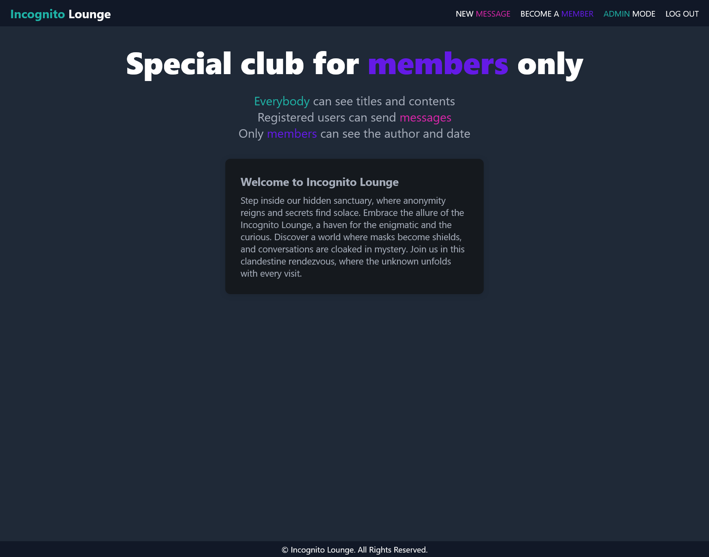
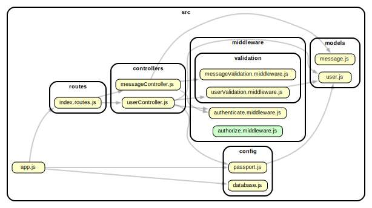

# Incognito Lounge - An Anonymous Posting Platform

#### Visit Incognito Lounge: [Incognito Lounge Online](https://incognito-lounge.onrender.com)

#### Passcodes:

-   Member passcode: `secret-member`
-   Admin passcode: `karprabha-admin`




## Description

Incognito Lounge all about building a private online community where members can write anonymous posts. Inside the Lounge, members can see who the author of a post is, but outside they can only see the story and wonder who wrote it.

## Features

-   **Anonymous Posting**: Members can write and publish anonymous posts, keeping their identity hidden from non-members.

-   **Secure Authentication**: Robust authentication system with password hashing to protect user accounts and data.

-   **Admin Role**: Admin users have the ability to delete posts and manage the platform effectively.

-   **User-Friendly Interface**: Intuitive and easy-to-navigate user interface, making it simple for members to interact with the lounge.

-   **Password Security**: Passwords are securely stored using bcrypt, ensuring user account safety.

## Dependency Graph



## Installation

1.  Clone the repository:

    ```bash
    git clone https://github.com/karprabha/members-only
    ```

2.  Navigate to the project directory:

    ```bash
    cd members-only
    ```

3.  Install dependencies:

    ```bash
    npm install
    ```

4.  Start the development server:
    ```bash
    npm run dev
    ```

## Technologies Used

-   "Node.js"
-   "Express.js"
-   "MongoDB"
-   "Pug"
-   "Passport.js"
-   "Bcrypt"
-   "SCSS"

## Upcoming Features

We have exciting plans for the future, including:

-   **Enhanced Anonymity Options**: Implement advanced anonymity settings, allowing users to selectively reveal their identities to specific members or groups within the lounge.

-   **Message Editing**: Enable users to edit their posted messages after submission, providing more control over their content.

-   **Member Interaction**: Introduce a private messaging system, enabling members to communicate with each other securely within the lounge.

-   **Content Moderation**: Implement content moderation tools for admins to ensure that posts align with the lounge's guidelines and values.
